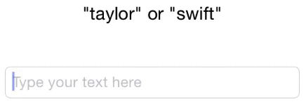

SpecificationPattern
====================

The **Specification** design pattern implemented in swift for iOS/OSX.

> In computer programming, the specification pattern is a particular software design pattern, whereby business rules can be recombined by chaining the business rules together using boolean logic.

Source: [wikipedia](http://en.wikipedia.org/wiki/Specification_pattern)

Example - Live text validation
------------------------------

The coloring are like this:

1. Red, when the text neither can be "taylor" nor "swift"
2. White, when the text is partially matching either "taylor" or "swift"
3. Green, when the text is exactly "taylor" or exactly "swift".

You find this in the Basic_iOS project in the Examples folder.

Example - Invoice handling
--------------------------

In the following example, we are retrieving invoices and sending them to a collection agency if

1. they are overdue,
2. notices have been sent, and
3. they are not already with the collection agency.

This example is meant to show the end result of how the logic is 'chained' together.

	let overDue = OverDueSpecification()
	let noticeSent = NoticeSentSpecification()
	let inCollection = InCollectionSpecification()
 
	// example of specification pattern logic chaining
	let sendToCollection = overDue & noticeSent & !inCollection
 
	let invoiceCollection = Service.invoices()
	for invoice in invoiceCollection {
	    if sendToCollection.isSatisfiedBy(invoice) {
	        invoice.sendToCollection()
	    }
	}
	

License
-------

Code is under the MIT license.

------

[@neoneye](http://twitter.com/neoneye)
